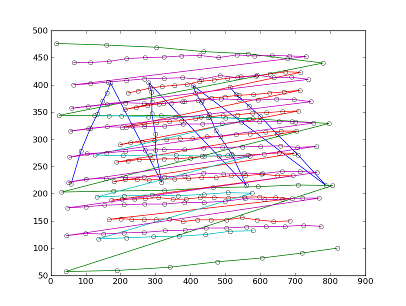

**************************
Manual display calibration
**************************

The simplest way to calibrate a display is a manual procedure. We do
this in several steps. 

  0. If you are using virtual displays, define your viewports.

  1. The intrinsic parameters (focal length, etc) are calculated. For
  projectors, this is done by finding the pixel coordinates that
  illuminate each corner of a checkerboard for several poses of the
  checkerboard. The checkerboard has a predetermined size and the
  calibration routine (based on ROS and OpenCV) solves to find the
  intrinsic parameters most consistent with these recorded locations.

  2. Once the intrinsic parameters are known, the pose of the display
  is found. (This is also called finding the extrinsic parameters.) 

  3. Finally, a mapping from projector pixels to geometry texture
  coordinates is performed.

Finding the intrinsic parameters
================================

Collect the data
----------------

You need to collect the pixel coordinates of each checkerboard corner
for several poses of a checkerboard.

::

    rosrun vros_display caldc4_manual_projector_calibration --cfg /tmp/caldc4.json

This will print a bunch coordinates each time you click the
mouse. Save the coordinates from left-to-right, top-to-bottom order
(in the checkerboard space), and don't miss any. All should be in view
of the projector, but it's good to get points near the edge.

Here's an example of data from several such checkerboards, plotted
with the example program in ``vros_display/homelab/picop-corners.py``.

Run the calibration
-------------------

The example program in ``vros_display/homelab/picop-corners.py`` run's
OpenCV's calibration routine (by way of ROS's camera_calibration
package). It emits the calibration in a file called
``display-intrinsic-cal-picop.bag``, which is a valid ROS Bag file
containing a topic ``/picop/camera_info`` of message type
``sensor_msgs/CameraInfo`` with the intrinsic calibration
parameters. You can view it with::

    rostopic echo -b display-intrinsic-cal-picop.bag -a

**Important note for displaying through mirrors:** If your (virtual)
display is illuminated through a mirror, make sure that the name of
your display has "mirror" in it. If you are using the
``vros_display/homelab/picop-corners.py`` example program, this will
ensure that saved intrinsic calibration flips the X coordinate.

Finding the extrinsic parameters
================================

Now that you have the intrinsic parameters of the display, it's time
to find the extrinsic parameters. Here the concept is to manually
align a projected image of some geometry to overlap as perfectly as
possible with some real geometry.

We need to play our intrinsic calibration to the display program, so
do this in one terminal window::

    rosbag play display-intrinsic-cal-picop.bag -l

Now, in other window, launch the program that projects the geometry
model.::

    # for the (entire) physical display
    rosrun vros_display caldc4_manual_camera_calibration --image /tmp/caldc4.json --geometry ../homelab/geom.json --camera picop

    # for a virtual display
    rosrun vros_display caldc4_manual_camera_calibration --image /tmp/caldc4.json --geometry ../homelab/geom.json --camera picop/vdisp

If you're not getting good alignment, make sure your geometry model is
accurate that that the geometry projection program has loaded the
intrinsic parameters.

Once you have obtained a good alignment, save the results.::

    # for the (entire) physical display
    CAMERA=picop rosrun vros_display record_camcal.sh

    # for a virtual display
    rosbag record /picop/vdisp/camera_info /picop/vdisp/tf -l1 -O picop-vdisp-camcal

This save a file called ``picop-camcal.bag`` which contains both the
intrinsic and extrinsic parameters. The extrinsic parameters are in
the topic ``/picop/tf`` with message type ``geometry_msgs/Transform``.

Mapping display pixels to geometry coordinates
==============================================

Now we have all the data we need. Create the texture coordinates::

    rosrun vros_display caldc6_create_display2tcs.py geom.json picop-camcal.bag

This will emit the file ``display2tcs-picop-tcs-lowres.png``. You can
verify the results by viewing the file. Quit
``caldc4_manual_camera_calibration`` if it still running and launch the display server.::

    rosrun vros_display ds_highlevel

Now, show our new image.::

    rosrun vros_display show_image.py display2tcs-picop-tcs-lowres.png
